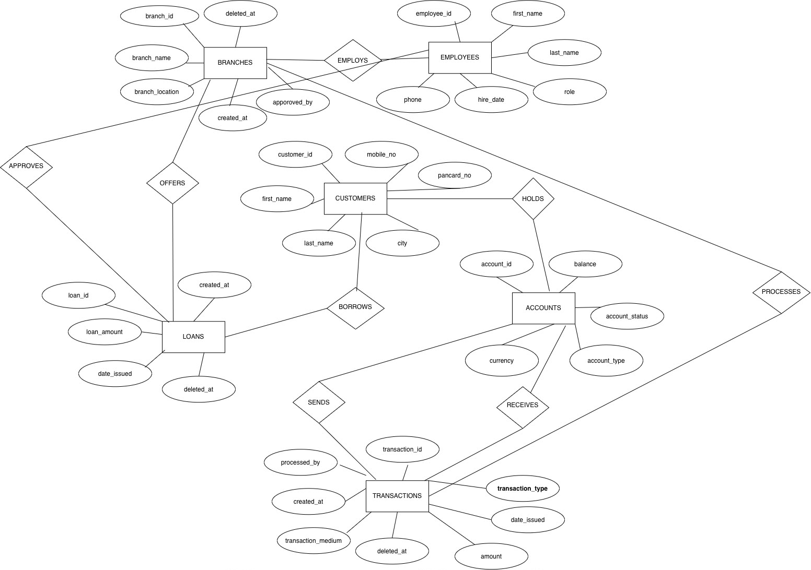

# Bank System Database Project

**CMPE343 Database Management Systems and Programming I**  
Cyprus International University  
Summer 2025-2026

---

## Project Overview

This project implements a Bank System Database using Supabase (cloud-based PostgreSQL). It manages customer information, bank accounts, transactions, and related banking operations.

**Features:**
- Database design with ER diagrams
- 6 related tables with constraints
- 15+ complex SQL queries with joins, aggregations, and functions
- Data manipulation operations (INSERT, UPDATE, DELETE)

---

## Team Members

| Name | Student ID | Contribution |
|------|-----------|--------------|
| Moataz Elmalik | 22409291 | Database Design, SQL Queries, GitHub Setup |
| Esther Nyota | 22014931 | ER Diagram, Data Population |
| Omer Yildirim | 22314646 | Query Development, Testing |
| Yusuf Adas | 22113354 | Report Writing, Documentation |

---

## Database Schema

### ER Diagram

### Tables

| Table | Description |
|-------|-------------|
| customers | Customer personal information |
| accounts | Bank account details |
| transactions | All financial transactions |
| branches | Bank branch locations |
| employees | Bank employees |
| loans | Customer loans |

### Entity-Relationship Model

customers (1) ----< (M) accounts  
customers (1) ----< (M) loans  
accounts (1) ----< (M) transactions  
branches (1) ----< (M) accounts  
branches (1) ----< (M) employees  
 
